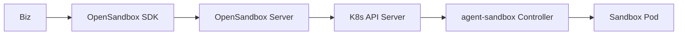
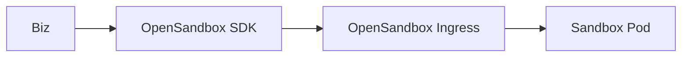
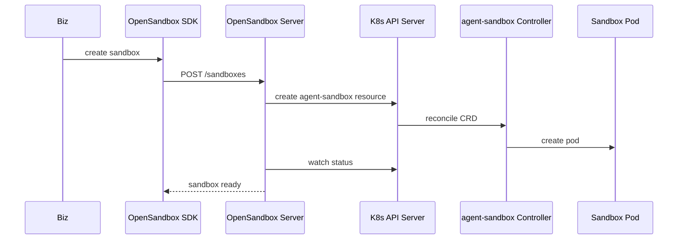

# OSEP-0002: kubernetes-sigs/agent-sandbox Support

<!-- toc -->
- [Summary](#summary)
- [Motivation](#motivation)
  - [Goals](#goals)
  - [Non-Goals](#non-goals)
- [Requirements](#requirements)
- [Proposal](#proposal)
  - [Notes/Constraints/Caveats](#notesconstraintscaveats)
  - [Risks and Mitigations](#risks-and-mitigations)
- [Design Details](#design-details)
- [Test Plan](#test-plan)
- [Drawbacks](#drawbacks)
- [Alternatives](#alternatives)
- [Infrastructure Needed](#infrastructure-needed)
- [Upgrade & Migration Strategy](#upgrade--migration-strategy)
<!-- /toc -->

## Summary

Add first-class support for `kubernetes-sigs/agent-sandbox` as a runtime backend
for OpenSandbox. This enables a Kubernetes-native sandbox lifecycle while
keeping the existing OpenSandbox SDK and API contract, and introduces a
dedicated ingress path for direct sandbox access.

## Motivation

OpenSandbox already provides a Kubernetes runtime roadmap and an SDK-first
experience, but users running `kubernetes-sigs/agent-sandbox` must currently
integrate it manually. A native integration unifies lifecycle management,
observability, and routing, letting teams adopt OpenSandbox without changing
their existing Kubernetes operational model.

### Goals

- Support creating, querying, and terminating sandboxes backed by
  `kubernetes-sigs/agent-sandbox` via the OpenSandbox server API.
- Provide two supported access paths:
  1) Biz -> OpenSandbox SDK -> OpenSandbox server -> K8s API server ->
     `agent-sandbox` pod.
  2) Biz -> OpenSandbox SDK -> OpenSandbox ingress
     (`components/ingress`) -> `agent-sandbox` pod.
- Preserve existing API and SDK behavior for non-agent-sandbox runtimes.

### Non-Goals

- Replacing or removing the existing Docker runtime.
- Implementing a full Kubernetes operator for OpenSandbox itself.
- Changing the sandbox lifecycle API or SDKs in a breaking way.

## Requirements

- Must use the existing OpenSandbox lifecycle API and SDKs without breaking
  changes.
- Must use the Kubernetes API server as the control plane for provisioning.
- Must support routing to sandbox pods through the existing ingress component.
- Must keep security posture aligned with current OpenSandbox auth and
  isolation requirements.

## Proposal

Introduce an `agent-sandbox` runtime implementation in the OpenSandbox server
that provisions sandboxes by creating and managing
`kubernetes-sigs/agent-sandbox` resources (and their resulting pods) through the
Kubernetes API server. The server remains the source of truth for sandbox
lifecycle and uses K8s-native status signals for reconciliation.

Implementation approach: extend the server with a new `agent-sandbox`
`SandboxService` implementation that reuses the existing Kubernetes helper code
in `server/services/k8s` as much as possible, since both flows submit resources
to the Kubernetes API server.

For access, support two primary chains:

1. Lifecycle API path
   - Biz -> OpenSandbox SDK -> OpenSandbox server -> K8s API server ->
     `agent-sandbox` pod
2. Direct ingress path
   - Biz -> OpenSandbox SDK -> OpenSandbox ingress
     (`components/ingress`) -> `agent-sandbox` pod

Both paths should expose the same sandbox endpoints (exec, file operations,
metrics) while allowing ingress routing policies to be configured per cluster.

### Notes/Constraints/Caveats

- The `agent-sandbox` controller lifecycle and CRD schema are external; the
  integration must track upstream changes.
- Sandbox pod images must include `execd` (or use an init/sidecar injection
  strategy consistent with existing runtimes).

### Risks and Mitigations

- Risk: K8s API latency or controller reconciliation delays cause slower
  sandbox readiness. Mitigation: asynchronous provisioning with explicit
  readiness checks and timeouts.
- Risk: CRD or API changes in `kubernetes-sigs/agent-sandbox` break integration.
  Mitigation: versioned runtime adapter and compatibility matrix in docs.
- Risk: ingress routing misconfiguration exposes pods. Mitigation: enforce
  namespace scoping, label selectors, and explicit port allowlists.

## Design Details

### Runtime Type and Configuration
- Add a new runtime type in server config, e.g. `runtime.type = agent-sandbox`.
- New config fields:
  - `runtime.kubernetes.kubeconfig` (optional; in-cluster supported)
  - `runtime.kubernetes.namespace`
  - `runtime.agent_sandbox.template` (CRD spec template or defaults)
  - `runtime.agent_sandbox.execd_mode` (embedded image vs init/sidecar)
  - `runtime.agent_sandbox.ingress_enabled` (default true)

### Lifecycle Flow
1. `POST /sandboxes`:
   - Validate request and build `agent-sandbox` CR or pod spec.
   - Create resource via K8s API server.
   - Persist sandbox record with runtime metadata and labels.
2. `GET /sandboxes/{id}`:
   - Read resource status and pod phase.
   - Map to OpenSandbox lifecycle states.
3. `DELETE /sandboxes/{id}`:
   - Delete `agent-sandbox` resource and cleanup related objects.

### Ingress Routing
- Extend `components/ingress` to recognize `agent-sandbox` pods through labels
  (e.g., `opensandbox.io/sandbox-id`).
- Map sandbox IDs and ports to ingress routes following existing router
  semantics.

### Observability and Metrics
- Surface pod readiness, node placement, and resource usage in server logs and
  metrics for troubleshooting.

### Implementation Plan
- Add a new `agent_sandbox` runtime module and a `SandboxService` implementation
  in the server layer.
- Reuse shared Kubernetes client setup, apply/delete helpers, and watch/status
  utilities from `server/services/k8s` to avoid duplicating API plumbing.
- Add a runtime adapter that maps OpenSandbox lifecycle states to
  `agent-sandbox` CRD/pod status, including readiness/termination conditions.
- Store the created resource name/namespace and labels in the sandbox metadata
  for reconciliation and cleanup.
- Extend server configuration to enable `agent-sandbox`, including CRD template
  or spec defaults and `execd` injection strategy (image vs init/sidecar).
- Add routing integration in `components/ingress` to discover pods by labels and
  publish routes for sandbox ports.
- Provide an example under `examples/` that creates a sandbox, executes a
  command, and tears it down using the SDK against the `agent-sandbox` runtime.

## Test Plan

- Unit tests for runtime adapter: spec generation, status mapping, cleanup.
- Integration tests with a local K8s cluster and `agent-sandbox` installed:
  create/list/delete sandbox, exec command, file ops, metrics.
- Ingress tests: ensure routing to the correct sandbox pod and port.

## Drawbacks

- Adds dependency on `agent-sandbox` CRD stability and controller behavior.
- Operational complexity for teams without existing Kubernetes expertise.

## Alternatives

- Continue with a native OpenSandbox Kubernetes runtime only. Rejected because
  it does not meet users already standardized on `agent-sandbox`.
- Provide an external adapter service instead of embedding in the server.
  Rejected due to added operational components and split observability.

## Infrastructure Needed

- Kubernetes cluster with `kubernetes-sigs/agent-sandbox` installed for CI/E2E.
- Optional: test images that bundle `execd` for sandbox pods.

## Upgrade & Migration Strategy

- Backwards compatible; default runtime remains unchanged.
- Enable by configuration; no migration required for existing Docker runtime
  users.
