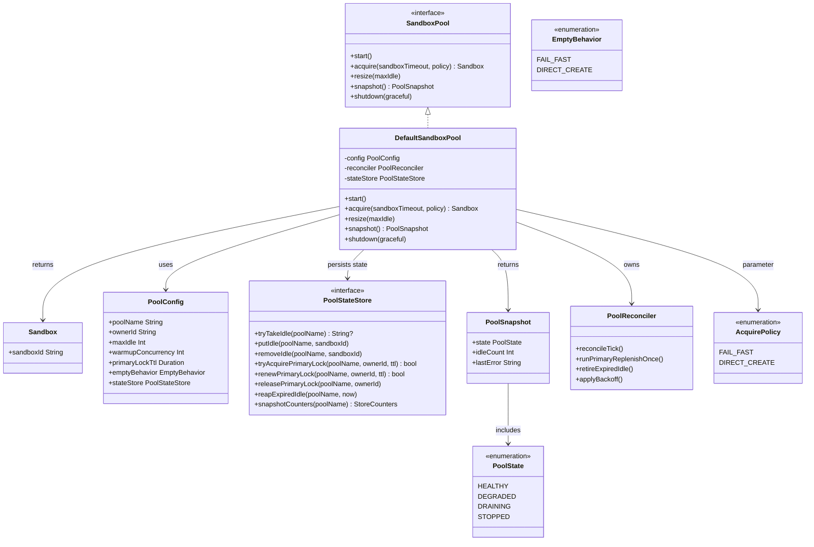
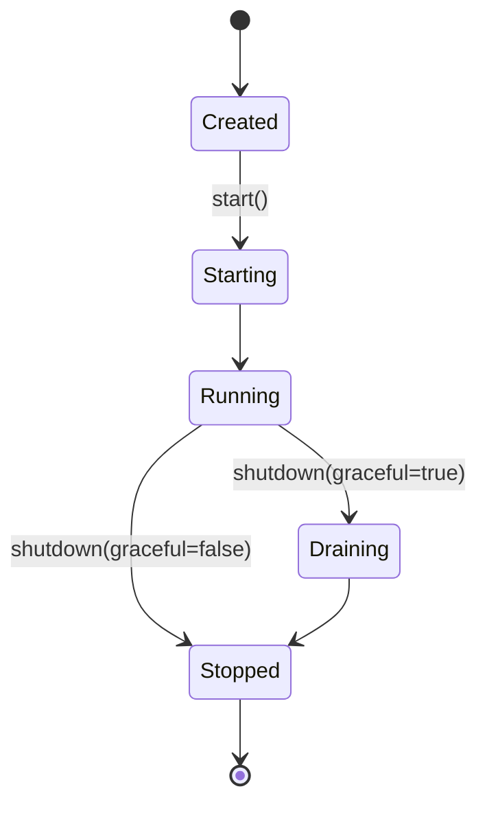
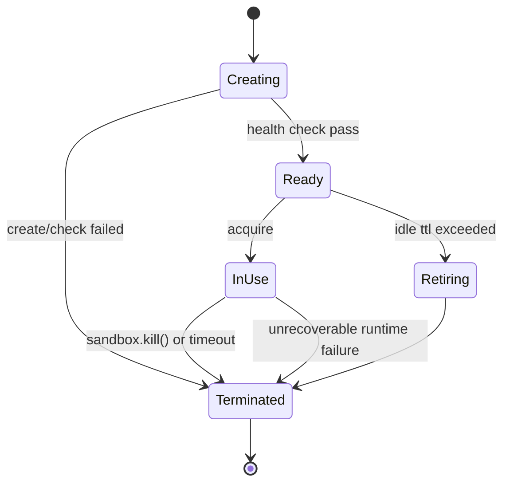
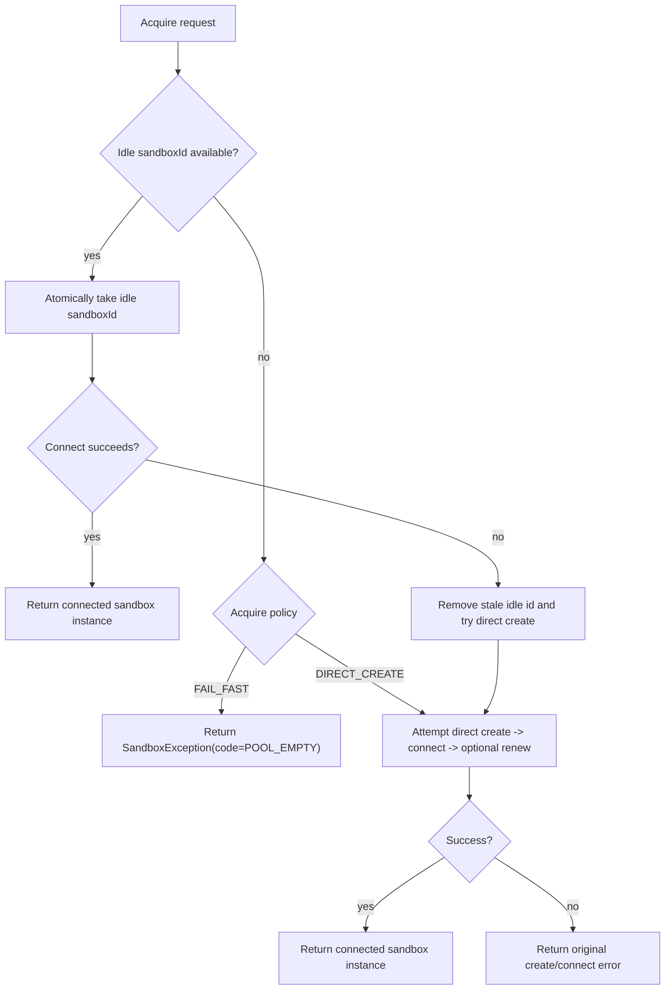
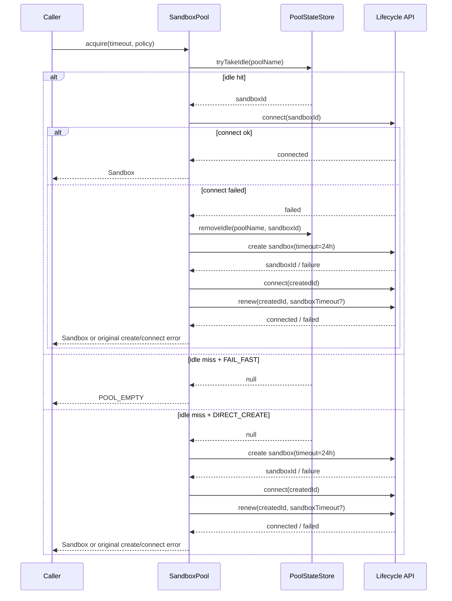
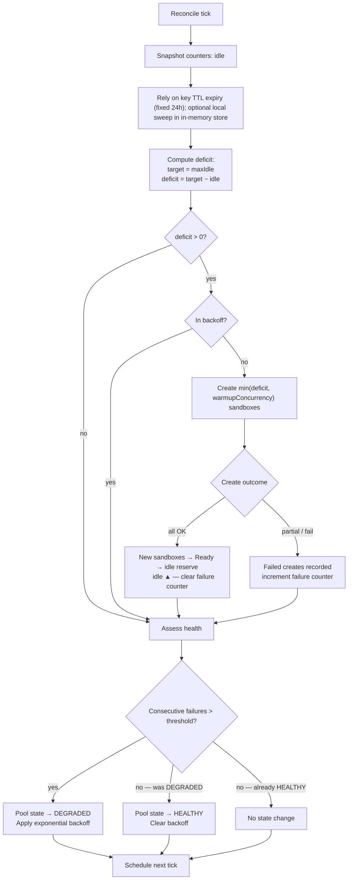
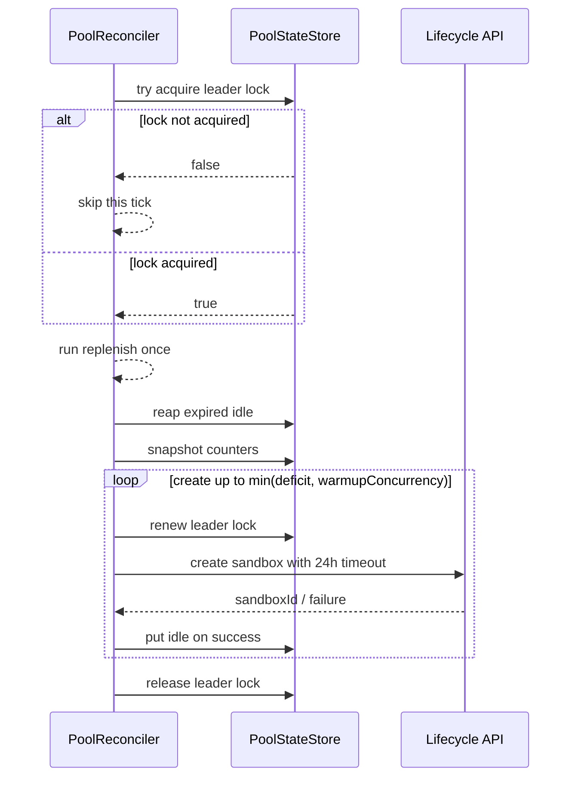
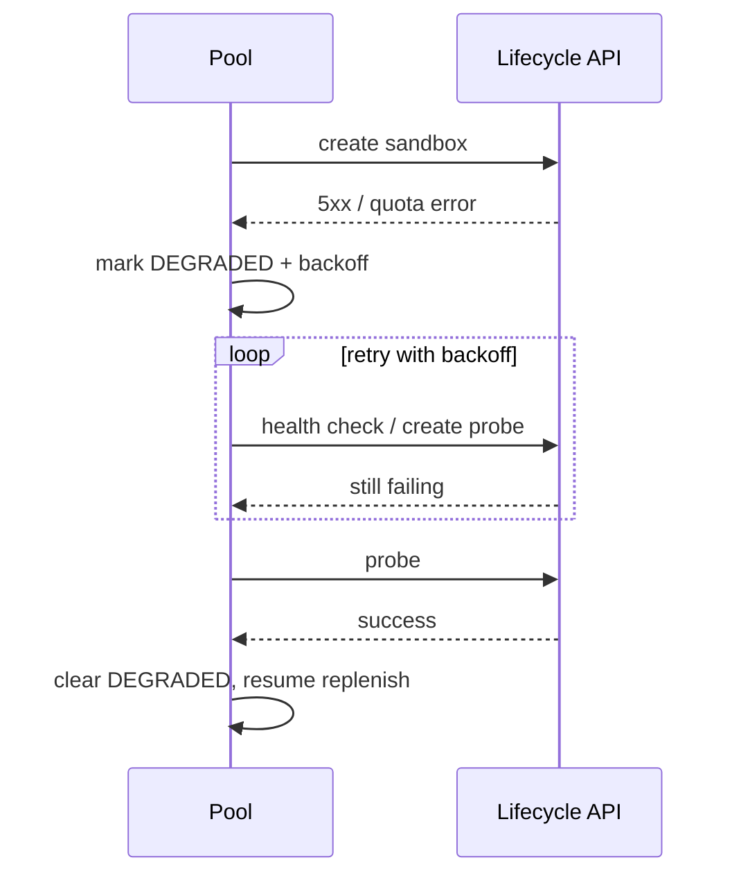

# OSEP-0005: Client-Side Sandbox Pool

<!-- toc -->
- [Summary](#summary)
- [Motivation](#motivation)
  - [Goals](#goals)
  - [Non-Goals](#non-goals)
- [Requirements](#requirements)
- [Proposal](#proposal)
  - [Functional Boundaries](#functional-boundaries)
  - [Notes/Constraints/Caveats](#notesconstraintscaveats)
  - [Risks and Mitigations](#risks-and-mitigations)
- [Design Details](#design-details)
  - [Design Reading Guide](#design-reading-guide)
  - [Terminology](#terminology)
  - [Class Model](#class-model)
  - [Public API](#public-api)
  - [Core Model: Properties and Constraints](#core-model-properties-and-constraints)
  - [Configuration](#configuration)
  - [State Store Abstraction](#state-store-abstraction)
  - [Pool and Sandbox Lifecycle](#pool-and-sandbox-lifecycle)
    - [Lifecycle operation pseudocode](#lifecycle-operation-pseudocode)
  - [Acquire Flow and Method Semantics](#acquire-flow-and-method-semantics)
    - [Acquire pseudocode](#acquire-pseudocode)
    - [Acquire sequence (simplified)](#acquire-sequence-simplified)
  - [Reconcile Loop](#reconcile-loop)
    - [Reconcile pseudocode](#reconcile-pseudocode)
    - [Reconcile sequence (simplified)](#reconcile-sequence-simplified)
  - [Failure Handling and Recovery](#failure-handling-and-recovery)
    - [Failure and backoff pseudocode](#failure-and-backoff-pseudocode)
  - [Observability](#observability)
  - [Compatibility and Evolution](#compatibility-and-evolution)
- [Test Plan](#test-plan)
- [Drawbacks](#drawbacks)
- [Alternatives](#alternatives)
- [Infrastructure Needed](#infrastructure-needed)
- [Upgrade & Migration Strategy](#upgrade--migration-strategy)
<!-- /toc -->

## Summary

This proposal introduces a client-side `SandboxPool` in the SDK for acquiring
ready sandboxes with predictable latency. The pool is an SDK-local component,
strictly decoupled from runtime-side pooling and infrastructure internals.

Pool-managed sandboxes are created through standard lifecycle create APIs.
Idle records use a fixed key TTL of 24h in the state store and are naturally
evicted on expiry. Callers can specify sandbox timeout duration at `acquire`
time.

Sandboxes are still treated as ephemeral and non-reusable. The pool only
maintains an idle buffer target; runtime remains the source of truth for hard
resource limits.

## Motivation

Per-request sandbox creation introduces avoidable cold-start cost. A client-side
reserve of clean, ready sandboxes improves first-byte latency while preserving a
clear caller-owned capacity model.

### Goals

- Define a first-class SDK abstraction for idle-buffer sandbox pooling.
- Provide clear and deterministic acquire behavior when idle is available or empty.
- Unify single-node and distributed modes behind one storage interface.
- Keep runtime coupling out of pool control logic.
- Preserve compatibility with existing SDK usage.
- Make caller responsibility explicit for cost and fallback strategy.

### Non-Goals

- Introducing or modifying runtime-side pool implementations.
- Auto-discovering backend resource limits from runtime/infrastructure.
- Guaranteeing zero cold starts under unlimited burst.
- Coupling pool behavior to Kubernetes, Docker, or any specific backend.
- Shipping a built-in opinionated distributed backend (e.g., Redis/etcd/SQL).
- Building strict global capacity accounting in SDK.

## Requirements

- Must work using only existing lifecycle APIs.
- Must not assume runtime-specific capabilities.
- Must not require lifecycle OpenAPI schema changes.
- Must expose deterministic behavior when idle buffer is empty.
- Must keep config explicit and caller-controlled.
- Must expose pool health, counters, and acquire latency metrics.

## Proposal

Add SDK-level `SandboxPool` that pre-creates and manages a target idle buffer
of clean, borrowable sandboxes.

Callers:
- `acquire` a sandbox,
- optionally provide `sandboxTimeout` for the acquired sandbox,
- use the sandbox,
- terminate sandbox via existing `sandbox.kill()` when done.

The pool is treated as a purely client-layer construct:

- No runtime coupling in control logic.
- No runtime-specific optimization assumptions.
- No hidden server-side autoscaling behavior.

Idle buffering is caller-owned and best-effort:
- `maxIdle` is a standby target/cap (not strict guarantee).
- Runtime enforces hard resource/quota limits.

Create compatibility:
- Pool create paths use existing lifecycle create APIs directly.
- Pool does not require any special extension key/value convention.

### Functional Boundaries

This OSEP explicitly defines the following boundaries:

- **In scope**
  - SDK-side model, APIs, and control loop.
  - Deterministic pool behavior under normal and degraded conditions.
  - Idle-buffer management for clean, ready sandboxes.
  - A pluggable state-store interface used by both single-node and distributed modes.
- **Out of scope**
  - Runtime-side scheduler policy.
  - Backend capacity introspection.
  - Any specific distributed datastore implementation bundled by default.

### Notes/Constraints/Caveats

- Runtime-level pooling may coexist but is irrelevant to this SDK model.
- Sandboxes are ephemeral and non-reusable after use.
- Runtime is authoritative for capacity limits; SDK pool does not enforce global hard caps.

### Risks and Mitigations

- Risk: Frequent empty-idle events under burst traffic.
  Mitigation: configurable empty behavior (`DIRECT_CREATE` or `FAIL_FAST`) and metrics.
- Risk: Backend state/lifecycle changes break assumptions.
  Mitigation: connect-on-acquire validation, stale-id cleanup, and adapter-based
  state handling.
- Risk: Multi-process replenish may issue duplicate create attempts.
  Mitigation: distributed primary-lock ownership, idempotent store operations,
  backoff, and runtime-side quota protection.

## Design Details

### Design Reading Guide

Recommended reading order for implementation and review:

1. **Class Model + Public API**: understand responsibilities and entrypoints.
2. **State Store Abstraction**: lock down single-node/distributed correctness contracts.
3. **Acquire Flow**: understand foreground request behavior and deterministic outcomes.
4. **Reconcile Loop**: understand background convergence and recovery behavior.
5. **Failure Handling**: verify retry/degrade/backoff behavior and caller actions.

### Terminology

- **Idle sandbox**: healthy sandbox ID currently available for borrow.
- **Authoritative store**: the single source of truth for idle membership.
- **Best-effort maxIdle**: convergence target, not a strict availability guarantee.
- **Leader (Primary)**: current lock owner for one `poolName`; allowed to run
  reconcile maintenance write paths.
- **Follower (Non-Leader)**: node that does not currently hold leader lock.

### Class Model



### Public API

Language-neutral contract (normative semantics, not tied to any SDK syntax):

```text
SandboxPool
  - start()
  - acquire(sandboxTimeout?, policy=DIRECT_CREATE) -> Sandbox
  - resize(maxIdle)
  - snapshot() -> PoolSnapshot
  - shutdown(graceful=true)

AcquirePolicy
  - FAIL_FAST
  - DIRECT_CREATE

PoolStateStore
  - tryTakeIdle(poolName) -> sandboxId?
  - putIdle(poolName, sandboxId)
  - removeIdle(poolName, sandboxId)
  - tryAcquirePrimaryLock(poolName, ownerId, ttl) -> bool
  - renewPrimaryLock(poolName, ownerId, ttl) -> bool
  - releasePrimaryLock(poolName, ownerId)
  - reapExpiredIdle(poolName, now)
```

Method intent:
- `acquire`: primary pool operation; it takes/creates a sandbox ID internally and
  returns a connected sandbox instance (`Sandbox` in host SDK terms).
- `PoolStateStore`: stores only IDs and pool coordination state; it must not store
  language runtime sandbox objects.
- `runPrimaryReplenishOnce` (internal): primary-only maintenance write path;
  independent from caller-facing `acquire` flow.

### Core Model: Properties and Constraints

Model entities:
- **Sandbox**: connected sandbox client object created from `sandboxId` on demand.
- **Sandbox ID**: canonical identity managed by pool and store.
- **Idle reserve**: clean and borrowable sandboxes only.

Constraints:
- Soft target: pool tries to keep `idle` near `maxIdle`
- Idle eligibility is validated at `acquire` connection time; stale IDs are
  removed and fallback to direct create is applied.
- Runtime authority: hard capacity/quota is enforced by runtime, not by SDK pool.

Counter transition rules:
- `acquire` from idle: `idle - 1`
- `replenish create success`: `idle + 1` (after persisted to `PoolStateStore`)
- `idle retire`: `idle - 1`

### Configuration

Configuration keys:
- `poolName` (required): user-defined readable name and namespace key for this logical pool.
- `ownerId` (required in distributed mode): unique process identity used for primary lock ownership.
- `maxIdle` (required): standby idle target/cap.
- `warmupConcurrency` (optional): max concurrent creation workers.
- `primaryLockTtl` (optional): lock TTL for distributed primary ownership.
- `emptyBehavior` (optional): behavior when idle buffer is empty (`DIRECT_CREATE` or `FAIL_FAST`).
- `stateStore` (required): injected implementation of `PoolStateStore`.

Default derivation (when omitted):
- `warmupConcurrency = max(1, ceil(maxIdle * 0.2))`
- `primaryLockTtl` should be larger than one reconcile tick interval.
- `idleTtl` is fixed at 24h (non-configurable in V1).
- `emptyBehavior = DIRECT_CREATE` (default). Caller may explicitly set
  `FAIL_FAST` for fail-fast semantics.
- `putIdle` may use an implementation-defined safety margin and write
  `effectiveIdleTtl = idleTtl - ttlSafetyMargin`; `effectiveIdleTtl` should stay
  greater than one reconcile tick interval.
- caller-provided numeric values override defaults for configurable keys.

### State Store Abstraction

The SDK pool logic is implementation-invariant and always uses a `PoolStateStore`
interface. Deployment mode is decided by which implementation is injected:

- `InMemoryPoolStateStore`: single-node/local mode.
- User-provided remote datastore implementation: distributed mode.

Contract semantics (normative):
- Pool scoping: all operations are namespaced by `poolName`; no cross-pool leakage.
- Atomic take: one idle sandbox can only be taken by one acquire operation.
- Idempotent put/remove operations for idle membership.
- Ordering: `tryTakeIdle` should prefer FIFO (oldest idle first) as a
  best-effort implementation goal. Strict FIFO is not required across all
  backends.
- Snapshot consistency at least eventually consistent for counters.

Lock semantics (normative):
- Primary lock semantics for distributed safety:
  - Only the current leader lock holder may execute **reconcile maintenance**
    writes (`putIdle`, `reapExpiredIdle`).
  - Foreground acquire-path write (`tryTakeIdle`) is allowed on **all** nodes,
    including leader and followers.
  - `removeIdle` on stale-id cleanup is an acquire-path cleanup write and is
    allowed on all nodes.
  - Lock ownership must be time-bounded (`ttl`) and renewable by owner only.
  - `tryAcquirePrimaryLock` is best-effort mutually exclusive by `poolName`.
  - Lock loss must cause immediate stop of replenish attempts on that node.

Idle TTL semantics (normative):
  - Idle entries are written with logical `idleTtl=24h`.
  - Store may apply a small `ttlSafetyMargin` when writing keys, as long as
    `effectiveIdleTtl > reconcileTickInterval`.
  - Distributed stores should rely on backend TTL expiry.
  - Single-node in-memory store must track `expiresAt` and evict expired entries
    via lazy-on-acquire and periodic sweep.
  - `reapExpiredIdle` is a unified store hook invoked by reconcile:
    - In-memory store: performs active sweep.
    - TTL-capable distributed store: may be no-op.
- Store data model scope:
  - Store persists only `sandboxId` and idle/lock coordination metadata.
  - Store must not require serialization of SDK language objects.

Implementation-owned settings:
- Any optional coordination/locking policy for distributed replenish is managed
  by each `PoolStateStore` implementation, not top-level `SandboxPool` config keys.

This keeps SDK behavior unified across modes while avoiding coupling to any
specific distributed system.

Distributed role boundary (normative):

| Responsibility area | Leader (lock owner) | Follower (non-leader) |
|---|---|---|
| Foreground `acquire` (`tryTakeIdle`) | Allowed | Allowed |
| Foreground stale-id cleanup (`removeIdle`) | Allowed | Allowed |
| Direct-create fallback in `acquire` | Allowed | Allowed |
| Reconcile replenish (`createSandbox` + `putIdle`) | Allowed | Not allowed |
| Reconcile TTL reap (`reapExpiredIdle`) | Allowed | Not allowed |
| Lock renew/release for reconcile ownership | Allowed | Not allowed (must fail/reject) |

Rule of thumb:
- Leader is a **background maintenance role**, not a request-routing role.
- Leader must continue serving foreground acquires exactly like any other node.
- Losing leader lock only stops reconcile maintenance on that node; it must not
  stop foreground acquire handling.

Pool naming rules:
- `poolName` is user-defined and human-readable.
- `poolName` must be stable for one logical pool lifecycle.
- Different business pools must use different `poolName` values.

#### PoolStateStore compliance matrix (required)

User-provided distributed stores must pass the following contract checks before
being considered production-ready:

| Contract area | Scenario | Expected result |
|---|---|---|
| Atomic idle take | Two concurrent `tryTakeIdle` requests target one idle `sandboxId` | Exactly one caller succeeds; the other receives empty result |
| Idempotent put | Duplicate `putIdle(poolName, sandboxId)` retries | Idle membership remains single-copy; counters do not overcount |
| Idempotent remove | Duplicate `removeIdle(poolName, sandboxId)` retries | Operation remains successful/no-op on second attempt |
| FIFO preference | Multiple idle entries with different insertion times | `tryTakeIdle` returns oldest-first as best effort (strict global FIFO not required) |
| Primary lock acquire | Multiple nodes call `tryAcquirePrimaryLock` concurrently | At most one node becomes current primary for that `poolName` window |
| Primary lock renew | Non-owner tries `renewPrimaryLock` | Renew is rejected; ownership is unchanged |
| Primary lock failover | Current primary crashes and lock TTL expires | Another node can acquire lock and continue replenish |
| Idle TTL expiry | Idle entry reaches 24h TTL | Entry is no longer borrowable and is removed/expired |
| Reconcile write ownership | Non-leader tries `putIdle` from reconcile path | Write is rejected (must not be applied) |
| Pool isolation | Same `sandboxId` key pattern used across different `poolName` values | No cross-pool take/remove visibility |
| Eventual counters | Mixed put/take/create/fail under load | `snapshotCounters` converges to actual membership within implementation SLA |

Implementation note:
- The SDK should provide a reusable compliance test suite that runs the above
  scenarios against any `PoolStateStore` implementation.

### Pool and Sandbox Lifecycle

Pool lifecycle:



#### Lifecycle operation pseudocode

```text
function start(pool):
  if pool.state in [RUNNING, STARTING]:
    return
  pool.state = STARTING
  spawn reconcile worker (periodic tick)
  if pool.config.maxIdle > 0:
    trigger immediate reconcile tick for warmup
  pool.state = RUNNING

function resize(pool, newMaxIdle):
  validate newMaxIdle >= 0
  pool.config.maxIdle = newMaxIdle
  trigger reconcile tick (do not block caller on convergence)

function shutdown(pool, graceful=true):
  stop accepting new acquire requests
  if !graceful:
    stop reconcile worker immediately
    pool.state = STOPPED
    return

  pool.state = DRAINING
  stop reconcile worker
  // no force-return path: borrowed sandboxes remain caller-owned
  wait until in-flight pool operations finish or drainTimeout reached
  pool.state = STOPPED
```

Sandbox state model:

This is a runtime-facing reference model used by pool logic. It is descriptive,
not a strict SDK-owned lifecycle contract.



### Acquire Flow and Method Semantics

`acquire` flow:

Diagram note: this flowchart is an overview. Normative behavior is defined by
the pseudocode and method semantics below.



Method semantics:
- `acquire`: returns a connected sandbox instance. Internally it first tries atomic idle-take
  by `sandboxId`, validates by connect, cleans stale IDs on connect failure, then
  applies empty behavior (`DIRECT_CREATE` default, or `FAIL_FAST` if configured).
  It may apply `sandboxTimeout` by calling lifecycle `renew`.

#### Acquire pseudocode (normative)

```text
function acquire(pool, sandboxTimeout, policy):
  sandboxId = stateStore.tryTakeIdle(pool.config.poolName) // atomic
  if sandboxId != null:
    try:
      handle = lifecycle.connectById(sandboxId) // host SDK's connect equivalent
      if sandboxTimeout != null:
        lifecycle.renew(sandboxId, sandboxTimeout) // throw original timeout/renew error on failure
      return handle
    catch e:
      // small-probability stale idle (killed externally/runtime reclaimed)
      // best-effort cleanup then fallback cold start
      stateStore.removeIdle(pool.config.poolName, sandboxId)
      lifecycle.tryKill(sandboxId)

  if policy == FAIL_FAST:
    throw SandboxException(code=POOL_EMPTY)

  // direct create uses standard create with 24h idle-style timeout.
  // create/connect failure handling and cleanup reuse existing lifecycle logic.
  createdId = lifecycle.createSandbox(timeout=24h)
  createdHandle = lifecycle.connectById(createdId)
  if sandboxTimeout != null:
    lifecycle.renew(createdId, sandboxTimeout)
  return createdHandle
```

#### Acquire sequence (simplified, informative)



Kill-only model:
- Pool does not expose return/finalize APIs.
- Caller ends sandbox lifecycle via existing `sandbox.kill()` (or runtime timeout).
- Pool does not track borrowed sandbox terminal state as a hard capacity source of truth.

Important behavior:
- Borrowing from idle at `idle == maxIdle` is expected and correct.
- Runtime capacity/quota remains authoritative under burst.
- 24h idle-key TTL reduces stale-id probability but does not guarantee runtime
  state is still `Running`; acquire handles this small-probability case by
  cleaning stale id and degrading to direct create.

### Reconcile Loop

The pool runs a background reconcile loop that fires on a periodic tick. Each
tick drives through four ordered phases:

Diagram note: this flowchart is an overview. Normative behavior is defined by
the pseudocode below.



#### Reconcile pseudocode (normative)

```text
function reconcileTick(poolName, cfg, now):
  // leader-gated scheduler: only current leader may run reconcile maintenance writes
  if !stateStore.tryAcquirePrimaryLock(poolName, cfg.ownerId, ttl=cfg.primaryLockTtl):
    return

  try:
    runPrimaryReplenishOnce(poolName, cfg, now)
  finally:
    stateStore.releasePrimaryLock(poolName, cfg.ownerId)

function runPrimaryReplenishOnce(poolName, cfg, now):
  // 1) idle keys use fixed 24h TTL and expire naturally in TTL-capable stores
  //    in-memory store may run local sweep/lazy eviction
  stateStore.reapExpiredIdle(poolName, now) // no-op allowed for TTL-capable backends
  counters = stateStore.snapshotCounters(poolName) // idle...

  // 2) replenish toward maxIdle, bounded by warmupConcurrency
  deficit = max(0, cfg.maxIdle - counters.idle)
  toCreate = min(deficit, cfg.warmupConcurrency)
  if toCreate == 0 or backoff.active():
    stateStore.renewPrimaryLock(poolName, cfg.ownerId, ttl=cfg.primaryLockTtl)
    return

  repeat toCreate times:
    if !stateStore.renewPrimaryLock(poolName, cfg.ownerId, ttl=cfg.primaryLockTtl):
      break // lock lost; stop creating immediately
    try:
      newId = lifecycle.createSandbox(timeout=24h)
      stateStore.putIdle(poolName, newId)
    catch e:
      recordFailureAndMaybeBackoff(e)
```

#### Reconcile sequence (simplified, informative)



Reconcile policy notes:
- Replenishment is background work to restore standby reserve.
- Under high foreground demand or runtime quota pressure, idle may drain below
  `maxIdle`; this is expected.
- In distributed mode, replenish is leader-gated: only the current leader lock
  holder performs reconcile maintenance create paths for a given `poolName`.
- Nodes that fail to acquire/renew primary lock skip replenish on that tick and
  retry lock acquisition on subsequent reconcile ticks.
- Caller-facing `acquire` path remains independent and is served by all nodes
  (leader included); it does not require leader ownership.
- Source of truth:
  - Single-node mode: in-memory state store is authoritative.
  - Distributed mode: centralized state store is authoritative.
- `PoolReconciler` never mutates state directly; all state changes go through
  `PoolStateStore`.

**Pool health state transitions:**

| From | To | Trigger |
|------|----|---------|
| `HEALTHY` | `DEGRADED` | Consecutive create failures exceed threshold |
| `DEGRADED` | `HEALTHY` | Probe or create succeeds, failure counter resets |
| `HEALTHY` / `DEGRADED` | `DRAINING` | `shutdown(graceful=true)` called |
| any | `STOPPED` | `shutdown(graceful=false)` or drain completes |

When `DEGRADED`, the reconciler applies exponential backoff to create attempts,
preventing cascading pressure on a failing backend while continuing to serve
from existing idle sandboxes (validated by connect-on-acquire).

### Failure Handling and Recovery

Expected deterministic outcomes:

- `FAIL_FAST`: no idle sandbox available -> `SandboxException(code=POOL_EMPTY)`.
- `DIRECT_CREATE`: no idle -> attempt direct create; create/connect failure ->
  propagate original lifecycle error code.
- `sandboxTimeout` application fails ->
  propagate original lifecycle timeout/apply error code.
- Backend quota/capacity errors -> typed create failures, no silent fallback.
- Empty idle + repeated replenish failure -> degraded pool with user-configured
  fallback (`DIRECT_CREATE` or `FAIL_FAST`).
- Idle connect failure on acquire -> remove stale idle ID and fallback to direct create.
- State-store contention on idle-take/put -> retry with bounded backoff.
- State-store unavailability -> degrade to policy-defined empty behavior.

Error-model alignment:
- SDK should surface pool failures through existing `SandboxException` hierarchy.
- Pool-specific error codes should be minimal and used only for pool-owned
  deterministic states (for example `POOL_EMPTY` under `FAIL_FAST`).
- Lifecycle create/connect/timeout failures should propagate original SDK/server
  error codes rather than being remapped into pool-only codes.

Minimal error-code contract (normative):

1. Pool may emit pool-specific codes only for pool-owned deterministic outcomes
   that lifecycle APIs cannot represent (for example `POOL_EMPTY`).
2. Pool must not wrap or remap lifecycle create errors.
3. Pool must not wrap or remap lifecycle connect errors.
4. Pool must not wrap or remap lifecycle timeout-apply/renew errors.
5. If pool performs best-effort cleanup (`removeIdle`, `tryKill`) after failure,
   cleanup errors must not replace the original lifecycle error returned to caller.
6. Store-layer failures may use pool/store-specific codes when no existing
   lifecycle error is applicable.

Error code action matrix:

| `error.code` | Typical trigger | Retryable | Caller action |
|---|---|---|---|
| `POOL_EMPTY` | `acquire` with `FAIL_FAST` and no idle sandbox available | No (for same call) | Fail request fast or retry later according to business SLA |
| `<existing lifecycle error codes>` | Direct create/connect/timeout apply path fails | Depends on specific error | Reuse existing caller retry/degrade policy for lifecycle errors |
| `POOL_STATE_STORE_UNAVAILABLE` | Store unavailable during idle take/put/lock operations | Yes | Apply bounded retry; if exhausted, follow `emptyBehavior` fallback |
| `POOL_STATE_STORE_CONTENTION` | Atomic take or lock-update conflicts | Yes | Retry with bounded backoff and jitter |

#### Failure and backoff pseudocode

```text
function handleCreateFailure(pool, err):
  pool.failureCount += 1
  emitCounter("create_failure_total", tags={code: classify(err)})
  if pool.failureCount > pool.config.degradedThreshold:
    pool.state = DEGRADED
    backoff.bump() // exponential: min(maxBackoff, base * 2^n)

function handleCreateSuccess(pool):
  pool.failureCount = 0
  if pool.state == DEGRADED:
    pool.state = HEALTHY
  backoff.reset()

function withStateStoreRetry(op):
  for attempt in 1..maxStoreRetries:
    try:
      return op()
    catch e if isContention(e) or isTransientStoreError(e):
      sleep(jitteredBackoff(attempt))
  throw SandboxException(code=POOL_STATE_STORE_UNAVAILABLE)
```

Recovery model:
- On repeated create failures: move to `DEGRADED`.
- Use exponential backoff for create/replenish attempts.
- Keep serving from existing idle when possible (validated by connect-on-acquire).
- Return to `HEALTHY` after successful probes/creates.



### Observability

Metrics and logs are emitted at SDK layer:

- Gauges: `pool_idle`.
- Timers: `acquire_latency_ms`, `create_latency_ms`.
- Counters: `pool_exhausted_total`, `create_failure_total`, `direct_create_total`, `direct_create_failure_total`.
- Structured logs include `pool_name`, `sandbox_id`, acquire policy, and state transitions.

### Compatibility and Evolution

- Existing `Sandbox.builder()` and `SandboxManager` flows remain unchanged.
- Pool feature is opt-in and additive.
- Single-node and distributed modes share the same SDK pool control logic and API.
- Mode selection is implementation-driven via `PoolStateStore` injection.
- SDK does not prescribe or bundle a specific distributed datastore backend.
- All store records and coordination are isolated by `poolName`.
- Runtime remains authoritative for hard capacity and quota limits.
- State handling is forward-compatible: unknown backend lifecycle states are treated
  conservatively (fallback to direct create on connect failure).
- Pool adapts through lifecycle adapters rather than runtime-specific paths.

## Test Plan

Test plan includes:

- Unit tests for state transitions and idle-buffer semantics.
- Concurrency tests for `acquire` and replenish races under empty-idle conditions.
- State-store contract tests (atomic idle-take, idempotent put/remove, pool scoping).
- Reference in-memory store tests and user-store compliance test suite.
- Idle TTL tests: fixed 24h expiry behavior for distributed TTL-backed stores and
  in-memory `expiresAt` sweep/lazy eviction.
- Acquire fallback tests: idle connect failure triggers stale-id cleanup and
  direct-create fallback path.
- Replenish boundedness tests: leader-only create path respects `warmupConcurrency`
  and allows small best-effort overshoot under concurrent acquire/reconcile races.
- Fault-injection tests for backend creation failures and timeouts.
- Integration tests in local and remote environments.
- Compatibility tests for non-pool SDK usage.
- Soak tests for leak/retire correctness.

## Drawbacks

- Additional SDK complexity and maintenance overhead.
- More caller-facing tuning knobs that can be misconfigured.
- No implicit protection from backend quota misalignment.

## Alternatives

- Keep per-request sandbox creation only.
- Build runtime-side pool controls into server APIs.
- Provide best-effort caching without explicit acquire policies.

## Infrastructure Needed

No new mandatory infrastructure is required. Optional benchmark and soak-test
environments are recommended for tuning default pool parameters.

## Upgrade & Migration Strategy

- Backward compatible: existing SDK usage remains unchanged.
- Pooling introduced as opt-in API.
- Start with conservative defaults and iterative tuning guidance.
