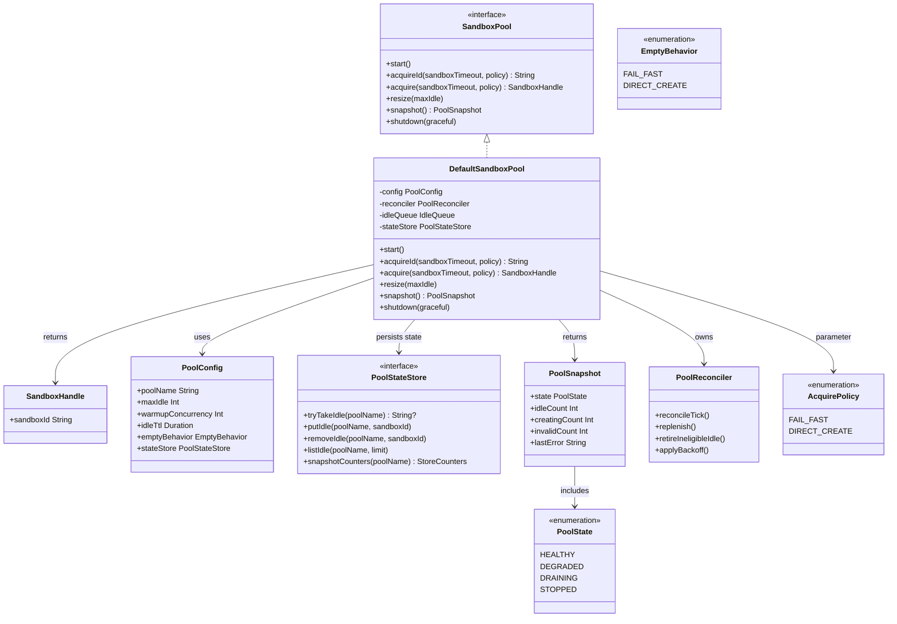
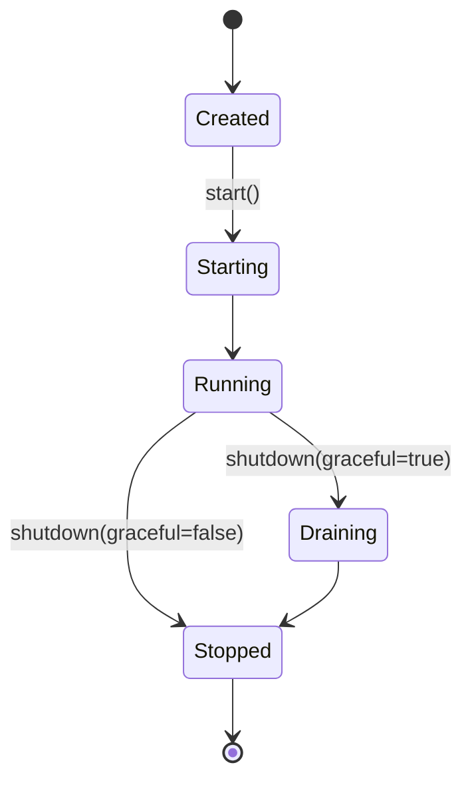
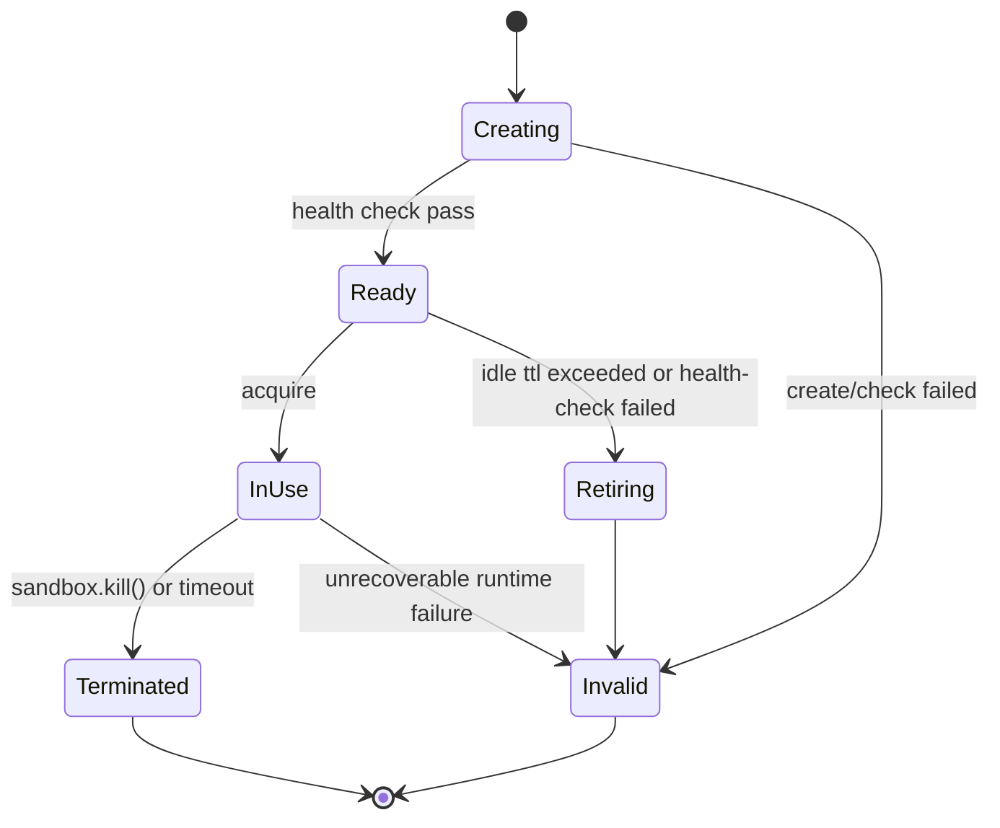
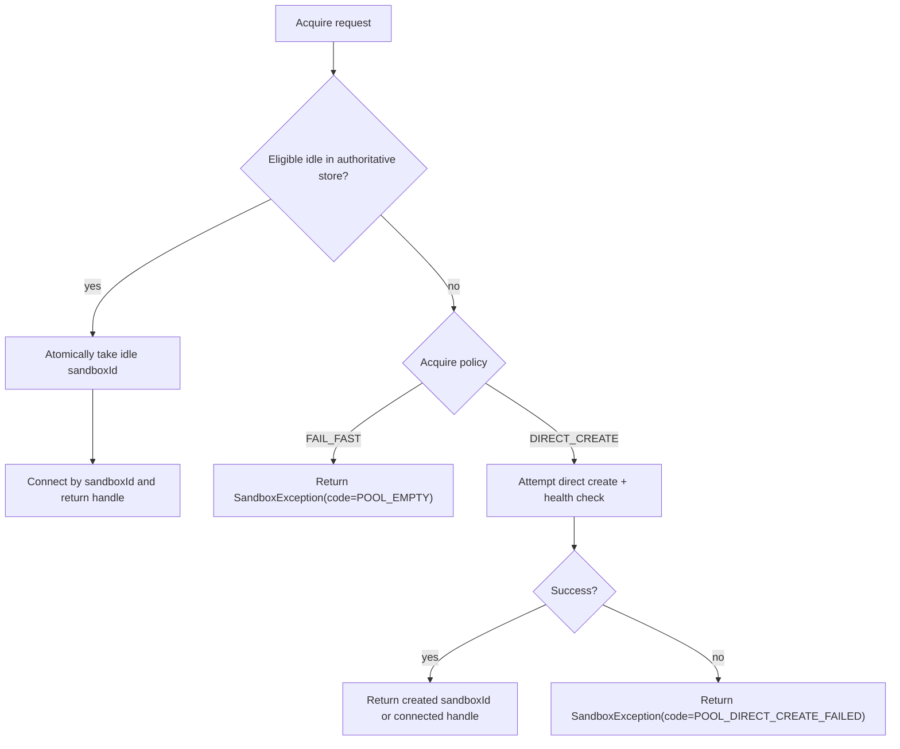
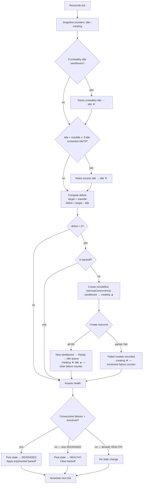
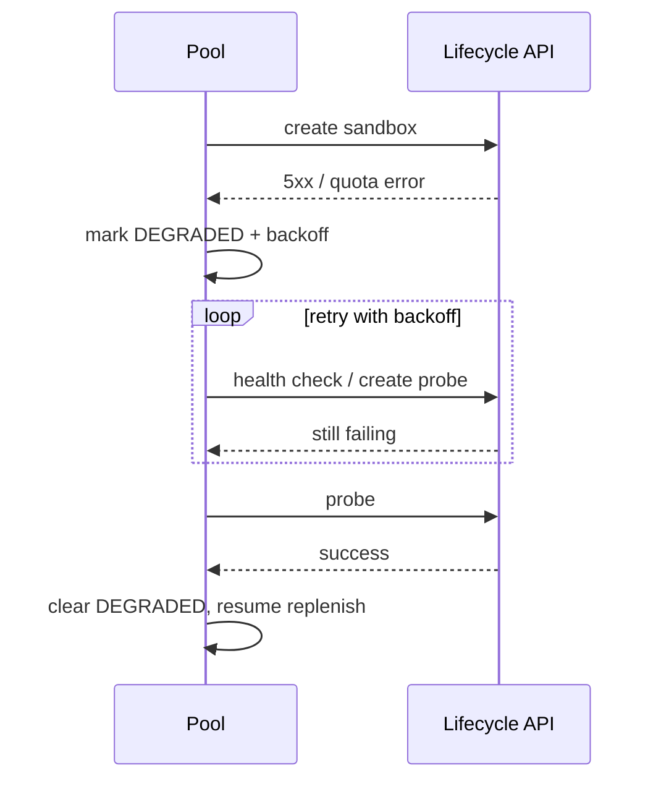

# OSEP-0005: Client-Side Sandbox Pool

<!-- toc -->
- [Summary](#summary)
- [Motivation](#motivation)
  - [Goals](#goals)
  - [Non-Goals](#non-goals)
- [Requirements](#requirements)
- [Proposal](#proposal)
  - [Functional Boundaries](#functional-boundaries)
  - [Notes/Constraints/Caveats](#notesconstraintscaveats)
  - [Risks and Mitigations](#risks-and-mitigations)
- [Design Details](#design-details)
  - [Class Model](#class-model)
  - [Public API](#public-api)
  - [Core Model: Properties and Constraints](#core-model-properties-and-constraints)
  - [Configuration](#configuration)
  - [State Store Abstraction](#state-store-abstraction)
  - [Resident Extension Contract](#resident-extension-contract)
  - [Pool and Sandbox Lifecycle](#pool-and-sandbox-lifecycle)
  - [Acquire Flow and Method Semantics](#acquire-flow-and-method-semantics)
  - [Reconcile Loop](#reconcile-loop)
  - [Failure Handling and Recovery](#failure-handling-and-recovery)
  - [Observability](#observability)
  - [Compatibility and Evolution](#compatibility-and-evolution)
- [Test Plan](#test-plan)
- [Drawbacks](#drawbacks)
- [Alternatives](#alternatives)
- [Infrastructure Needed](#infrastructure-needed)
- [Upgrade & Migration Strategy](#upgrade--migration-strategy)
<!-- /toc -->

## Summary

This proposal introduces a client-side `SandboxPool` in the SDK for acquiring
ready sandboxes with predictable latency. The pool is an SDK-local component,
strictly decoupled from runtime-side pooling and infrastructure internals.

Pool-managed sandboxes are created in resident mode through `extensions`
conventions while remaining fully compatible with existing lifecycle OpenAPI.
Callers can specify sandbox timeout duration at `acquire` time.

Sandboxes are still treated as ephemeral and non-reusable. The pool only
maintains an idle buffer target; runtime remains the source of truth for hard
resource limits.

## Motivation

Per-request sandbox creation introduces avoidable cold-start cost. A client-side
reserve of clean, ready sandboxes improves first-byte latency while preserving a
clear caller-owned capacity model.

### Goals

- Define a first-class SDK abstraction for idle-buffer sandbox pooling.
- Provide clear and deterministic acquire behavior when idle is available or empty.
- Unify single-node and distributed modes behind one storage interface.
- Keep runtime coupling out of pool control logic.
- Preserve compatibility with existing SDK usage.
- Make caller responsibility explicit for cost and fallback strategy.

### Non-Goals

- Introducing or modifying runtime-side pool implementations.
- Auto-discovering backend resource limits from runtime/infrastructure.
- Guaranteeing zero cold starts under unlimited burst.
- Coupling pool behavior to Kubernetes, Docker, or any specific backend.
- Shipping a built-in opinionated distributed backend (e.g., Redis/etcd/SQL).
- Building strict global capacity accounting in SDK.

## Requirements

- Must work using only existing lifecycle APIs.
- Must not assume runtime-specific capabilities.
- Must not require lifecycle OpenAPI schema changes.
- Must use `extensions` as the compatibility path for resident creation hints.
- Must expose deterministic behavior when idle buffer is empty.
- Must keep config explicit and caller-controlled.
- Must expose pool health, counters, and acquire latency metrics.

## Proposal

Add SDK-level `SandboxPool` that pre-creates and manages a target idle buffer
of clean, borrowable sandboxes.

Callers:
- `acquire` a sandbox,
- optionally provide `sandboxTimeout` for the acquired sandbox,
- use the sandbox,
- terminate sandbox via existing `sandbox.kill()` when done.

The pool is treated as a purely client-layer construct:

- No runtime coupling in control logic.
- No runtime-specific optimization assumptions.
- No hidden server-side autoscaling behavior.

Idle buffering is caller-owned and best-effort:
- `maxIdle` is a standby target/cap (not strict guarantee).
- Runtime enforces hard resource/quota limits.

Resident creation compatibility:
- Pool create paths attach resident intent via fixed extension:
  `{"resident": "true"}`.
- Runtime/provider decides whether resident mode is supported.
- Unsupported resident mode must fail with typed create error (no silent downgrade).

### Functional Boundaries

This OSEP explicitly defines the following boundaries:

- **In scope**
  - SDK-side model, APIs, and control loop.
  - Deterministic pool behavior under normal and degraded conditions.
  - Idle-buffer management for clean, ready sandboxes.
  - A pluggable state-store interface used by both single-node and distributed modes.
- **Out of scope**
  - Runtime-side scheduler policy.
  - Backend capacity introspection.
  - Any specific distributed datastore implementation bundled by default.

### Notes/Constraints/Caveats

- Runtime-level pooling may coexist but is irrelevant to this SDK model.
- Resident mode is a convention expressed via `extensions`, not a new core API field.
- Sandboxes are ephemeral and non-reusable after use.
- Runtime is authoritative for capacity limits; SDK pool does not enforce global hard caps.

### Risks and Mitigations

- Risk: Frequent empty-idle events under burst traffic.
  Mitigation: configurable empty behavior (`DIRECT_CREATE` or `FAIL_FAST`) and metrics.
- Risk: Backend state/lifecycle changes break assumptions.
  Mitigation: conservative eligibility checks and adapter-based state handling.
- Risk: Resident extension not supported consistently across providers.
  Mitigation: fixed server-SDK convention (`resident=true`) and fail-fast typed errors.
- Risk: Multi-process replenish may issue duplicate create attempts.
  Mitigation: idempotent store operations, backoff, and runtime-side quota protection.

## Design Details

### Class Model



### Public API

Language-neutral contract (normative semantics, not tied to any SDK syntax):

```text
SandboxPool
  - start()
  - acquireId(sandboxTimeout?, policy=DIRECT_CREATE) -> sandboxId
  - acquire(sandboxTimeout?, policy=DIRECT_CREATE) -> SandboxHandle
  - resize(maxIdle)
  - snapshot() -> PoolSnapshot
  - shutdown(graceful=true)

AcquirePolicy
  - FAIL_FAST
  - DIRECT_CREATE

PoolStateStore
  - tryTakeIdle(poolName) -> sandboxId?
  - putIdle(poolName, sandboxId)
  - removeIdle(poolName, sandboxId)
  - listIdle(poolName, limit) -> [sandboxId]
  - markCreating(poolName, leaseId, ttl)
  - completeCreating(poolName, leaseId, sandboxId)
  - failCreating(poolName, leaseId, reason)
  - reapExpiredCreating(poolName, now)
```

Method intent:
- `acquireId`: primary pool operation; returns a borrowable `sandboxId`.
- `acquire`: convenience wrapper implemented as "acquire ID, then connect by ID"
  using the host SDK's existing `Sandbox.connect` equivalent.
- `PoolStateStore`: stores only IDs and pool coordination state; it must not store
  language runtime sandbox objects.

### Core Model: Properties and Constraints

Model entities:
- **SandboxHandle**: connected sandbox client object created from `sandboxId` on demand.
- **Sandbox ID**: canonical identity managed by pool and store.
- **Idle reserve**: clean and borrowable sandboxes only.

Constraints:
- Soft target: pool tries to keep `idle` near `maxIdle`
- Eligibility: idle sandboxes must pass health checks.
- Runtime authority: hard capacity/quota is enforced by runtime, not by SDK pool.

Counter transition rules:
- `acquire` from idle: `idle - 1`
- `replenish create start`: `creating + 1`
- `replenish create success`: `creating - 1`, `idle + 1` (after persisted to `PoolStateStore`)
- `replenish create failure`: `creating - 1`
- `idle retire`: `idle - 1`

### Configuration

Configuration keys:
- `poolName` (required): user-defined readable name and namespace key for this logical pool.
- `maxIdle` (required): standby idle target/cap.
- `warmupConcurrency` (optional): max concurrent creation workers.
- `idleTtl` (optional): idle retirement threshold.
- `emptyBehavior` (optional): behavior when idle buffer is empty (`DIRECT_CREATE` or `FAIL_FAST`).
- `stateStore` (required): injected implementation of `PoolStateStore`.

Default derivation (when omitted):
- `warmupConcurrency = max(1, ceil(maxIdle * 0.2))`
- caller-provided numeric values always override defaults.

### State Store Abstraction

The SDK pool logic is implementation-invariant and always uses a `PoolStateStore`
interface. Deployment mode is decided by which implementation is injected:

- `InMemoryPoolStateStore`: single-node/local mode.
- User-provided remote datastore implementation: distributed mode.

Required store semantics:
- Pool scoping: all operations are namespaced by `poolName`; no cross-pool leakage.
- Atomic take: one idle sandbox can only be taken by one acquire operation.
- Idempotent put/remove operations for idle membership.
- Snapshot consistency at least eventually consistent for counters.
- Creating lease semantics for distributed safety:
  - Every create attempt must be represented by a lease record (`leaseId`, `ttl`).
  - Expired leases must be reclaimable via `reapExpiredCreating`.
  - `completeCreating` and `failCreating` must be idempotent for the same `leaseId`.
- Store data model scope:
  - Store persists only `sandboxId` and coordination metadata (idle/creating leases/counters).
  - Store must not require serialization of SDK language objects.

Implementation-owned settings:
- Any optional coordination/locking policy for distributed replenish is managed
  by each `PoolStateStore` implementation, not top-level `SandboxPool` config keys.

This keeps SDK behavior unified across modes while avoiding coupling to any
specific distributed system.

Pool naming rules:
- `poolName` is user-defined and human-readable.
- `poolName` must be stable for one logical pool lifecycle.
- Different business pools must use different `poolName` values.

#### PoolStateStore compliance matrix (required)

User-provided distributed stores must pass the following contract checks before
being considered production-ready:

| Contract area | Scenario | Expected result |
|---|---|---|
| Atomic idle take | Two concurrent `tryTakeIdle` requests target one idle `sandboxId` | Exactly one caller succeeds; the other receives empty result |
| Idempotent put | Duplicate `putIdle(poolName, sandboxId)` retries | Idle membership remains single-copy; counters do not overcount |
| Idempotent remove | Duplicate `removeIdle(poolName, sandboxId)` retries | Operation remains successful/no-op on second attempt |
| Lease lifecycle | `markCreating` then `completeCreating` for same `leaseId` | `creating` is decremented once and idle membership becomes visible once |
| Lease failure | `markCreating` then `failCreating` for same `leaseId` | `creating` is decremented once; no orphan idle record created |
| Lease expiry reclaim | Worker crashes after `markCreating`; TTL expires; `reapExpiredCreating` runs | Expired lease is reclaimed and no permanent `creating` leak remains |
| Pool isolation | Same `sandboxId` key pattern used across different `poolName` values | No cross-pool take/remove visibility |
| Eventual counters | Mixed put/take/create/fail under load | `snapshotCounters` converges to actual membership within implementation SLA |

Implementation note:
- The SDK should provide a reusable compliance test suite that runs the above
  scenarios against any `PoolStateStore` implementation.

### Resident Extension Contract

To preserve lifecycle OpenAPI compatibility, resident mode is requested via
`extensions` in create calls.

Fixed convention (server-SDK agreement):
- `extensions["resident"] = "true"`

Contract rules:
- SDK treats extension payload as opaque pass-through.
- Provider/runtime is responsible for interpreting `resident=true`.
- Provider must return explicit failure when resident mode is unsupported or ignored.
- SDK should emit warning logs and metrics for resident create fallback/error paths.

### Pool and Sandbox Lifecycle

Pool lifecycle:



Sandbox state model:



### Acquire Flow and Method Semantics

`acquire` flow:



**How empty-idle handling works:**

Sandboxes are non-reusable. When idle buffer is empty, pool does not wait for
"return"; it follows configured empty behavior:

1. `DIRECT_CREATE`: acquire directly creates sandbox and returns it.
2. `FAIL_FAST`: acquire returns immediately with `SandboxException(code=POOL_EMPTY)`.

Method semantics:
- `start`: creates worker/reconciler and begins reserve maintenance.
- `acquireId`: returns `sandboxId` from idle reserve or follows empty behavior;
  may apply `sandboxTimeout` to sandbox lifecycle.
- `acquire`: convenience method that internally calls `acquireId` and then connects
  via existing SDK capability.
- `resize`: updates idle target and lets reconciler converge.
- `snapshot`: returns counters and health state.
- `shutdown`: graceful drain or immediate stop.

Kill-only model:
- Pool does not expose return/finalize APIs.
- Caller ends sandbox lifecycle via existing `sandbox.kill()` (or runtime timeout).
- Pool does not track borrowed sandbox terminal state as a hard capacity source of truth.

Important behavior:
- Borrowing from idle at `idle == maxIdle` is expected and correct.
- Runtime capacity/quota remains authoritative under burst.

### Reconcile Loop

The pool runs a background reconcile loop that fires on a periodic tick. Each
tick drives through five ordered phases:



**Phase-by-phase breakdown:**

| Phase | Action | Counter effect |
|-------|--------|----------------|
| 1. Audit | Snapshot `idle`, `creating` | — |
| 2. Evict | Retire unhealthy idle sandboxes | `idle ▼` |
| 3. Shrink | When `idle > maxIdle`, retire those that exceed `idleTtl` | `idle ▼` |
| 4. Replenish | Compute `deficit = maxIdle - idle`. If `deficit > 0` and not in backoff, create up to `min(deficit, warmupConcurrency)` sandboxes | `creating ▲` during creation; on success `creating ▼ idle ▲`; on failure `creating ▼` |
| 5. Health | Evaluate consecutive failure counter against threshold | Pool state transitions (see below) |

Reconcile policy notes:
- Replenishment is background work to restore standby reserve.
- Under high foreground demand or runtime quota pressure, idle may drain below
  `maxIdle`; this is expected.
- In distributed mode, duplicate replenish attempts may occur; runtime quota and
  store coordination should make duplicates harmless.
- Source of truth:
  - Single-node mode: in-memory state store is authoritative.
  - Distributed mode: centralized state store is authoritative; local queue/cache
    must never independently mutate membership.

**Pool health state transitions:**

| From | To | Trigger |
|------|----|---------|
| `HEALTHY` | `DEGRADED` | Consecutive create failures exceed threshold |
| `DEGRADED` | `HEALTHY` | Probe or create succeeds, failure counter resets |
| `HEALTHY` / `DEGRADED` | `DRAINING` | `shutdown(graceful=true)` called |
| any | `STOPPED` | `shutdown(graceful=false)` or drain completes |

When `DEGRADED`, the reconciler applies exponential backoff to create attempts,
preventing cascading pressure on a failing backend while continuing to serve
from existing eligible idle sandboxes.

### Failure Handling and Recovery

Expected deterministic outcomes:

- `FAIL_FAST`: no eligible idle -> `SandboxException(code=POOL_EMPTY)`.
- `DIRECT_CREATE`: no idle -> attempt direct create; failure ->
  `SandboxException(code=POOL_DIRECT_CREATE_FAILED)`.
- Resident extension unsupported/ignored ->
  `SandboxException(code=POOL_RESIDENT_UNSUPPORTED)`.
- `sandboxTimeout` application fails ->
  `SandboxException(code=POOL_TIMEOUT_APPLY_FAILED)`.
- Backend quota/capacity errors -> typed create failures, no silent fallback.
- Empty idle + repeated replenish failure -> degraded pool with user-configured
  fallback (`DIRECT_CREATE` or `FAIL_FAST`).
- Unhealthy idle -> immediate retire path, never reused.
- State-store contention on idle-take/put -> retry with bounded backoff.
- State-store unavailability -> degrade to policy-defined empty behavior.

Error-model alignment:
- SDK should surface pool failures through existing `SandboxException` hierarchy
  with explicit `error.code` values, rather than introducing a separate
  exception hierarchy for pool-only cases.

Error code action matrix:

| `error.code` | Typical trigger | Retryable | Caller action |
|---|---|---|---|
| `POOL_EMPTY` | `acquireId` with `FAIL_FAST` and no eligible idle | No (for same call) | Fail request fast or retry later according to business SLA |
| `POOL_DIRECT_CREATE_FAILED` | Empty idle and direct create/create health check fails | Yes (bounded backoff) | Retry with jitter, or degrade feature path |
| `POOL_RESIDENT_UNSUPPORTED` | Resident hint rejected/unsupported by provider | No (until config/provider changes) | Disable pool or switch runtime/provider capability |
| `POOL_TIMEOUT_APPLY_FAILED` | Applying sandbox timeout fails | Depends on backend error | Retry once; if persistent, terminate sandbox and surface error |
| `POOL_STATE_STORE_UNAVAILABLE` | Store unavailable during idle take/put/lease operations | Yes | Apply bounded retry; if exhausted, follow `emptyBehavior` fallback |
| `POOL_STATE_STORE_CONTENTION` | Atomic take or lease update conflicts | Yes | Retry with bounded backoff and jitter |

Recovery model:
- On repeated create failures: move to `DEGRADED`.
- Use exponential backoff for create/replenish attempts.
- Keep serving from existing eligible idle when possible.
- Return to `HEALTHY` after successful probes/creates.



### Observability

Metrics and logs are emitted at SDK layer:

- Gauges: `pool_idle`, `pool_creating`, `pool_invalid`.
- Timers: `acquire_latency_ms`, `create_latency_ms`, `health_check_latency_ms`.
- Counters: `pool_exhausted_total`, `create_failure_total`, `direct_create_total`, `direct_create_failure_total`.
- Structured logs include `pool_name`, `sandbox_id`, acquire policy, and state transitions.

### Compatibility and Evolution

- Existing `Sandbox.builder()` and `SandboxManager` flows remain unchanged.
- Pool feature is opt-in and additive.
- Single-node and distributed modes share the same SDK pool control logic and API.
- Mode selection is implementation-driven via `PoolStateStore` injection.
- SDK does not prescribe or bundle a specific distributed datastore backend.
- All store records and coordination are isolated by `poolName`.
- Runtime remains authoritative for hard capacity and quota limits.
- Resident behavior is requested via fixed extension convention
  (`extensions["resident"]="true"`),
  preserving existing lifecycle OpenAPI compatibility.
- Providers that do not implement resident hint must fail deterministically.
- State handling is forward-compatible: unknown backend lifecycle states are treated
  conservatively (not-ready unless explicitly validated healthy).
- Pool adapts through lifecycle adapters rather than runtime-specific paths.

## Test Plan

Test plan includes:

- Unit tests for state transitions and idle-buffer semantics.
- Concurrency tests for `acquire` and replenish races under empty-idle conditions.
- State-store contract tests (atomic idle-take, idempotent put/remove, pool scoping).
- Reference in-memory store tests and user-store compliance test suite.
- Compliance coverage for lease lifecycle/reclaim and eventual-counter convergence.
- Fault-injection tests for backend creation failures and timeouts.
- Integration tests in local and remote environments.
- Compatibility tests for non-pool SDK usage.
- Soak tests for leak/retire correctness.

## Drawbacks

- Additional SDK complexity and maintenance overhead.
- More caller-facing tuning knobs that can be misconfigured.
- No implicit protection from backend quota misalignment.

## Alternatives

- Keep per-request sandbox creation only.
- Build runtime-side pool controls into server APIs.
- Provide best-effort caching without explicit acquire policies.

## Infrastructure Needed

No new mandatory infrastructure is required. Optional benchmark and soak-test
environments are recommended for tuning default pool parameters.

## Upgrade & Migration Strategy

- Backward compatible: existing SDK usage remains unchanged.
- Pooling introduced as opt-in API.
- Start with conservative defaults and iterative tuning guidance.
